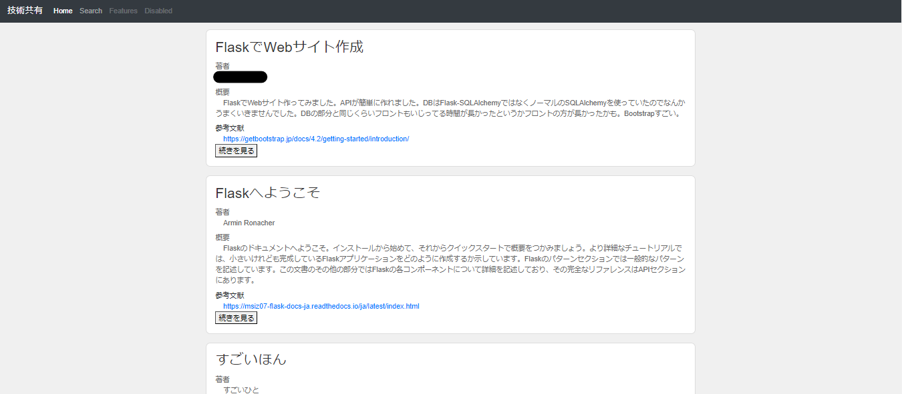
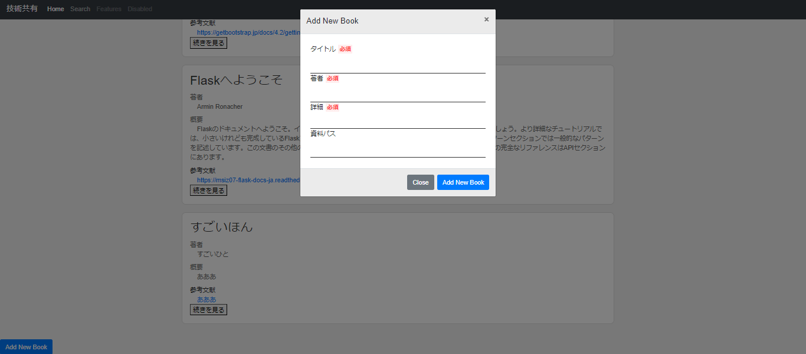

# おすすめ本まとめサイト（サンプル）

## 目的
Webアプリを作ってみたい！

## OS
Windows
## 言語・フレームワーク
* Windows
* Python  
* JavaScript  
* CSS  
* HTML

* Flask  
* flask_sqlalchemy
* BootStrap

## 機能
* DBから本情報取得処理
* 取得結果をマップしたオブジェクトをもとに本情報表示
* 新規おすすめ本登録フォーム
* DBへの登録処理

## 画面イメージ
ホーム画面

本の追加画面
